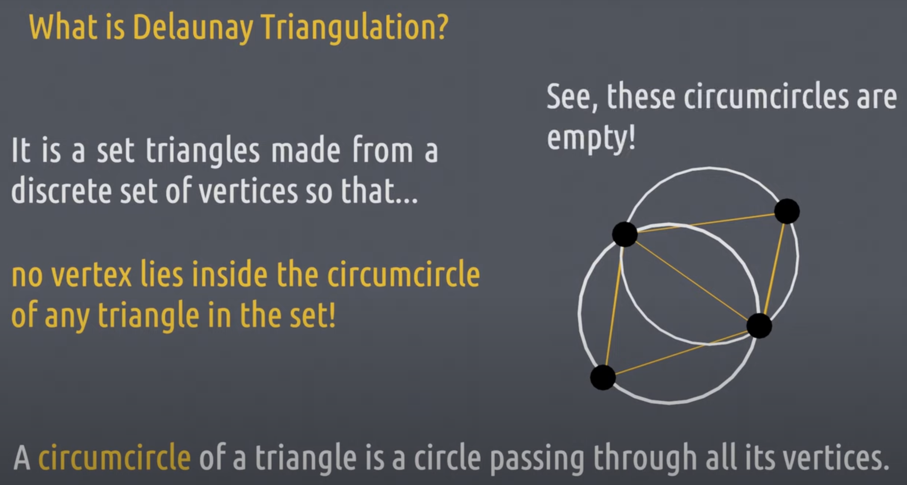

### What is Delaunay Triangulation?

Set of triangles made from a discrete set of vertices so that no vertex lies inside the circumcircle of any triangle in the set.

A circumcircle of a triangle is a circle passing through all its vertices.

### Computing Delaunay Triangulations

One way is Bowyer-Watson algorithm.

1. Find a triangle containing all our points. Call this "super-triangle".
2. Select a point and look for triangles whose circumcircle contain our point (initially super-triangle).
3. Connect super-triangle vertices to our point to make a new set of triangles.
4. Repeat these steps for all other points.

See [also: quick video](https://www.youtube.com/watch?v=GctAunEuHt4&ab_channel=SCIco).

See [also: 2D Delaunay Triangulation. By Hand. Without a Voronoi Diagram. Catie Jo](https://medium.com/@catiejo/2d-delaunay-triangulation-by-hand-without-a-voronoi-diagram-513156fd549f)

